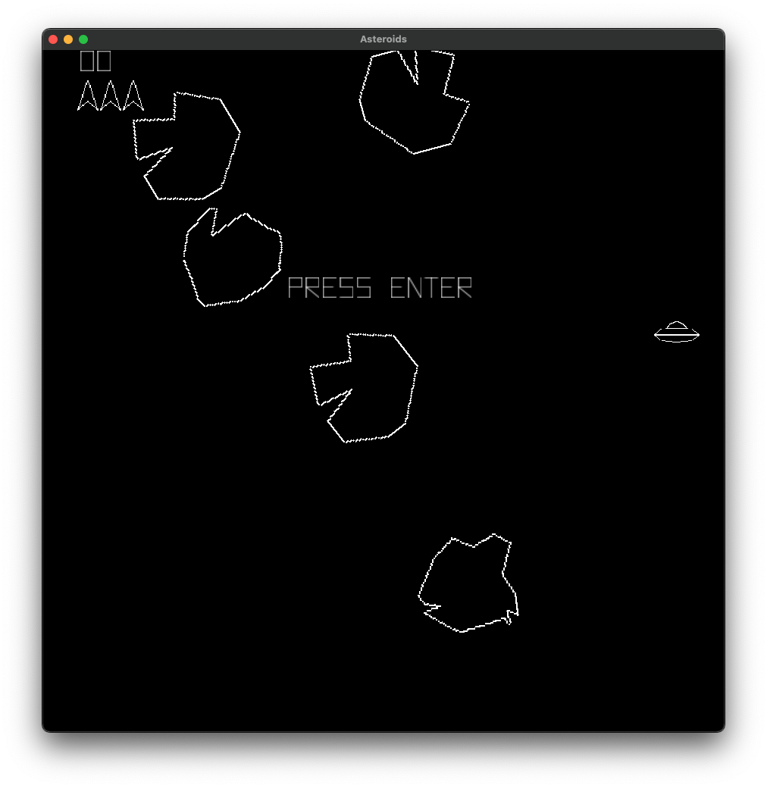

# opengl-asteroids-game

This is my implementation of the classic Asteroids arcade game. This project was develop in C++ using OpenGL for studying purposes.

You can run the game with make `make all`.

### Screenshots

### Disclaimer

Please note that I am relatively new to C++ and graphics programming.
This project was created for learning purposes, and there may be areas that can be improved.
I would be very grateful for any recommendations, suggestions, or feedback to help me improve my skills and the project.
